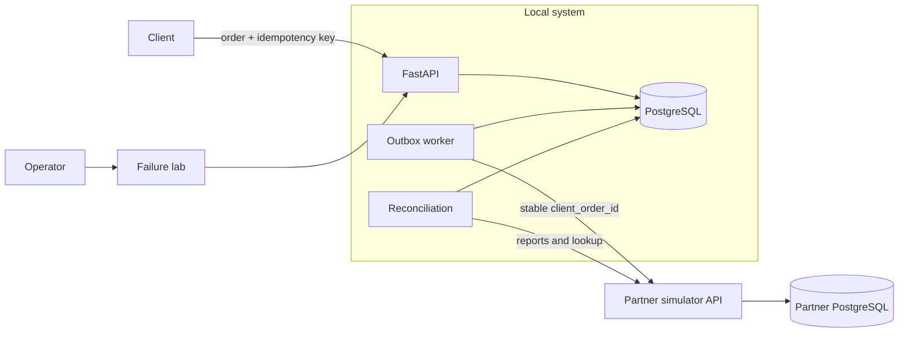
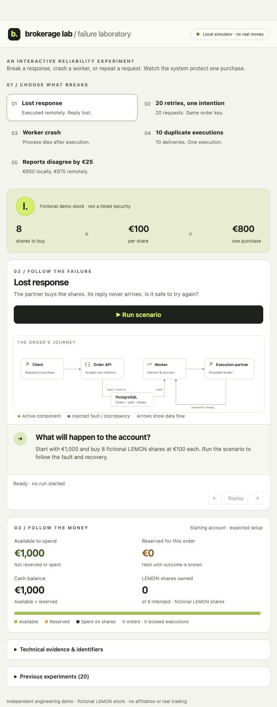

# Brokerage Lab

Brokerage Lab is a local reliability demo for investment-order processing. It
focuses on a deceptively difficult question:

> Did the execution partner process the order, and can the local system prove
> what happened without charging the client twice?

The project demonstrates durable idempotency, atomic cash reservation, an
outbox worker, explicit handling of unknown remote outcomes, execution
deduplication, append-only accounting and evidence-based reconciliation.

It is an engineering MVP built for local exploration. It does not connect to a
broker or process real money.

## What the project demonstrates

- **Atomic order intake.** The order, cash reservation, idempotency result and
  outbox message commit in one PostgreSQL transaction.
- **Safe retries.** Repeating the same client intention returns the original
  result; changing the payload under the same key produces a visible conflict.
- **At-least-once delivery.** Workers use short database leases and never keep a
  transaction open during partner HTTP calls.
- **Explicit uncertainty.** A timeout produces `UNKNOWN`, not `REJECTED`, and
  reserved cash remains protected until evidence resolves the outcome.
- **Exactly-once local accounting effects.** Duplicate execution notifications
  converge on one journal transaction and one instrument movement.
- **Auditable cash history.** EUR cash entries are balanced and append-only;
  corrections create linked reversing entries instead of rewriting history.
- **Evidence-based reconciliation.** Report differences open investigation
  cases but never change cash without confirmed execution evidence.

## Architecture



The application and partner simulator own separate databases and communicate
only over HTTP. No transaction spans both systems.

### Lost-response recovery

```mermaid
sequenceDiagram
    participant A as Application API
    participant D as Local PostgreSQL
    participant W as Worker
    participant P as Partner API

    A->>D: Commit order, reservation, idempotency and outbox
    W->>D: Claim message and commit lease
    W->>P: Submit stable client_order_id
    P->>P: Persist one execution
    P--xW: Response is lost
    W->>D: Record UNKNOWN; keep reservation
    W->>P: Lookup original client_order_id
    P-->>W: Return existing execution
    W->>D: Atomically book cash, position and final status
```

The local database can guarantee atomic local state. It cannot roll back a
remote execution. Safe recovery therefore depends on a stable client order ID,
partner-side deduplication and lookup by that identifier.

## Failure laboratory

The web panel runs five repeatable experiments against real local services and
persisted database state. Every run receives a fresh account funded with
EUR 1,000 and stores its checkpoints for later inspection.

| Scenario | Expected result |
|---|---|
| Lost response | The order becomes `UNKNOWN`; EUR 800 remains reserved; lookup recovers one execution |
| Concurrent retries | Twenty submissions with one idempotency key create one order and one reservation |
| Worker crash | A subprocess exits after the partner commit; lease expiry and lookup recover the same execution |
| Duplicate execution | Ten concurrent deliveries produce one journal transaction and one position movement |
| Report mismatch | A EUR 975 / EUR 950 difference opens an investigation without changing cash |

The four trading scenarios use a fictional `SYNTH-100` instrument displayed as
**LEMON** in the panel. The mismatch scenario uses controlled report fixtures
and does not submit an order.



Watch the [50-second failure scenario demo](artifacts/brokerage-lab-demo.mp4).

Additional evidence:
[lost response](artifacts/lost_response.png),
[concurrent retries](artifacts/retry_storm.png),
[worker crash](artifacts/worker_crash.png),
[duplicate execution](artifacts/duplicate_execution.png), and
[report mismatch](artifacts/amount_mismatch.png).

## Run locally

### Requirements

- Docker Desktop with Docker Compose
- a local `.env` created from [`.env.example`](.env.example)

### Start the stack

```bash
cp .env.example .env
# Replace every placeholder in .env with a private local value.
docker compose up --build
```

Compose starts the application API, operator panel, outbox worker, independent
partner simulator, separate PostgreSQL databases and a one-shot migration job.

Open:

- [Failure laboratory](http://127.0.0.1:8000/lab) — username `operator`,
  password from `OPERATOR_API_KEY`;
- [OpenAPI documentation](http://127.0.0.1:8000/docs).

Stop the stack without removing its volumes:

```bash
docker compose down
```

## API example

Create a synthetic order with a new idempotency key:

```bash
curl -X POST http://127.0.0.1:8000/demo/orders \
  -H "X-API-Key: $DEMO_API_KEY" \
  -H "Idempotency-Key: example-order-1" \
  -H "Content-Type: application/json" \
  -d '{"quantity": 8}'
```

Submitting the same normalized payload with the same client and key replays the
original response. Reusing the key with a different payload returns `422` and
creates no additional financial effects.

The optional `/v1` surface demonstrates selected public API conventions such as
Bearer authentication, decimal strings, UTC timestamps and cursor pagination.
It shares the same durable order and idempotency records as the original demo
API. See [API conventions](docs/api-conventions.md) for deliberate differences.

## Verification

```bash
make verify
```

The command builds an isolated test image, checks formatting and linting, and
runs the complete PostgreSQL-backed suite. Coverage includes concurrent order
submission, idempotent replay, transaction rollback, worker leases, lost
responses, process crashes, execution deduplication, accounting invariants,
authorization boundaries and reconciliation cutoffs.

The Postman collection in [`postman/`](postman/) provides an additional HTTP
walkthrough. Keep credentials in a private Postman environment; do not commit
exported secrets.

## Design decisions

### Domain and persistence are separate

Pydantic models enforce values and state transitions. SQLAlchemy models handle
persistence. This keeps HTTP and database concerns out of the domain rules while
retaining explicit mapping between layers.

### Services own transaction boundaries

Application services decide when to commit. Repositories flush but do not
commit, and the Unit of Work rolls back by default. Multi-table financial
effects therefore have one visible transaction owner.

### Delivery is at least once

The outbox worker claims work in a short transaction, calls the partner outside
the transaction, and acknowledges only with the active lease token. Duplicate
delivery is expected and handled through stable identities and idempotent local
booking.

### Accounting history is append-only

Every cash journal contains two balanced EUR entries. Instrument units live in
a separate register. Database constraints, deferred triggers and restricted
runtime grants protect committed history from application-role updates and
deletes.

### Reconciliation does not invent evidence

The reconciler compares records at a compatible cutoff and records missing,
duplicate, amount and status differences. It can recover a missing local
execution only after partner lookup returns identified `FILLED` evidence.

## Project structure

| Area | Main modules |
|---|---|
| API and authentication | `api.py`, `api_v1.py`, `auth.py`, `auth_v1.py` |
| Domain and contracts | `domain.py`, `contracts.py`, `schemas.py` |
| Transactions and persistence | `services.py`, `repositories.py`, `unit_of_work.py`, `models.py` |
| Accounting | `ledger.py`, `executions.py` |
| Delivery and partner boundary | `worker.py`, `transport.py`, `partner.py` |
| Reconciliation and operations | `reconciliation.py`, `operations.py` |
| Demonstration UI | `scenarios.py`, `panel.py`, `templates/lab.html` |

## Scope and limitations

This repository is a local engineering demonstration, not a production
brokerage service. It intentionally supports one synthetic EUR instrument,
whole-unit BUY orders and full execution or definitive rejection. It excludes
real market connectivity, FX, partial fills, settlement, taxes, KYC, corporate
actions and production deployment.

Production hardening would additionally require:

- individual operator identities, RBAC and immutable security audit records;
- a separate service identity with signed webhooks or mutual TLS for execution
  callbacks;
- bounded report pagination and checkpointed reconciliation;
- retention, archival and privacy policies for operational evidence;
- production SLOs, distributed rate limiting, tracing and alerting;
- dependency, secret and container scanning, an SBOM and signed artifacts;
- high-availability deployment and disaster-recovery procedures.

Failure injection and money-changing operator endpoints are blocked outside
development mode. Privacy principal and justification headers are recorded as
client-supplied claims, not as authenticated identity.

## Development

```bash
make setup        # Create a local virtual environment and install dev tools
make format       # Format and apply safe lint fixes
make lint         # Check formatting and lint rules
make verify-local # Run the PostgreSQL-backed suite from the local environment
make benchmark    # Measure replay latency against a running local stack
```

For schema changes, generate and review an Alembic migration before restarting
the stack. Application and partner schemas use separate Alembic configurations
and separate databases.
