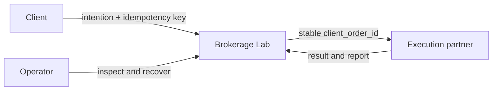
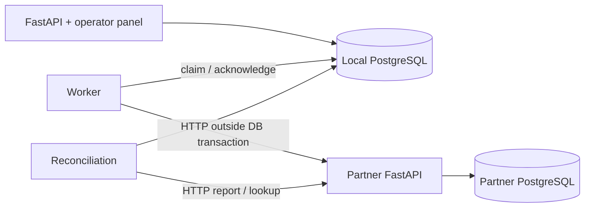

# Brokerage Lab

A local failure lab for one deceptively hard question: **did the execution
partner actually execute the order?** The project shows which guarantees belong
to the local transaction and which depend on the partner contract. It uses
synthetic EUR buy orders only—no real trading, FX, partial fills or settlement.

## Run

```bash
docker compose up --build
```

Docker Desktop and a private `.env` are required. The existing local `.env` is ready; a new clone needs the values described in `.env.example` once. Compose reads them automatically. There is no host Python or manual migration step.

- [Operator panel](http://127.0.0.1:8000/lab): browser login `operator`, password `OPERATOR_API_KEY` from `.env`.
- [Swagger](http://127.0.0.1:8000/docs): client requests use `X-API-Key`; operator requests use `X-Operator-Key`.
- `/health/live` checks the API process; `/health/ready` checks local database access. Neither promises that the partner is available.

Compose starts the API, worker, partner simulator and two PostgreSQL 17 databases. A separate migration job applies local Alembic migrations and seeds missing accounts before API/worker startup. The partner applies its own migrations. Existing balances and history survive restart. `docker compose down` stops the stack without deleting volumes.

## Try the failures

The panel contains five repeatable experiments. Every run gets a fresh funded
account and stores its run ID, seed, status and evidence. The walkthrough marks
the failure and recovery on the architecture diagram while showing the observed
cash, reservation and position after each checkpoint. You can pause, step through
or replay a completed run without placing another order.

The trading scenarios buy 8 shares at EUR 100 from a EUR 1,000 account.
**LEMON** is only the display name for the synthetic `SYNTH-100` instrument; it
is not a listed security or a real integration. The report-mismatch scenario is
different: it compares two controlled reports and does not submit an order.

Scenarios call the partner over HTTP; the partner persists its own orders and reports.

| Scenario | Expected evidence |
|---|---|
| Lost response | UNKNOWN retains 800 EUR; lookup resolves one execution; final cash 200, reservation 0 |
| 20 retries | One client/key produces one order and reservation despite concurrent requests |
| Worker crash | A real subprocess exits after remote commit; lease expiry and lookup recover the same execution |
| 10 executions | Concurrent delivery produces one journal transaction and instrument movement |
| 975 / 950 mismatch | Explicit report fixture creates an OPEN amount discrepancy; cash remains unchanged |

The mismatch is a **controlled report fixture**, not a possible quantity at the fixed 100 EUR unit price. FAILED runs remain visible. Metrics come from database rows, not scripted success counters. Missing-record metrics count unresolved cases and can include repeated reports.

For individual orders, submit `POST /demo/orders` with `{"quantity":8}`, `X-API-Key` and a new `Idempotency-Key`. A new account starts with 1000 EUR. Reservation gives 1000 posted / 800 reserved / 200 available; execution gives 200 / 0 / 200. The background worker may finish before your next read.

Same client/key and normalized payload replays the original 201 response, even after execution. Read the returned order URL for current state. Changed payload under that key returns 422. Different keys mean distinct intentions. Keys have no automatic expiry in this MVP. Foreign accounts return 404; missing credentials return 401.

## Verify

```bash
make verify       # Build test container; Ruff + all tests on real PostgreSQL
```

Import both files in [`postman/`](postman/) and put your private keys into a local Postman environment. Run the collection in order: it creates fresh scenario data and includes replay, conflicts, ownership, cash, positions and reconciliation. Never export an environment containing real keys into Git.

Latest local verification (2026-09-30): **131 tests passed** on PostgreSQL;
Ruff lint and format checks passed. The suite still reports two deprecation
warnings from the Starlette/AnyIO test stack.

Presentation artifacts (PNG only, refreshed 2026-09-30):

- [Panel overview](artifacts/panel.png)
- [Lost response: funds remain reserved](artifacts/lost_response.png)
- [20 retries: one purchase](artifacts/retry_storm.png)
- [Worker crash: before recovery](artifacts/worker_crash.png)
- [Duplicate execution: one accounting effect](artifacts/duplicate_execution.png)
- [Report mismatch: investigation stays open](artifacts/amount_mismatch.png)

Screenshots show the current UI and recorded checkpoints from actual local
scenario runs. Video recordings are deferred; no recordings are included.

## Development

Optional PyCharm interpreter: `.venv/bin/python`. `make setup` installs the package and development dependencies. Run from the repository root:

```bash
make format       # Ruff format, then Ruff check --fix
make lint         # Check without modifying files
make verify-local # Full PostgreSQL tests using your local environment
make benchmark    # Live HTTP replay measurement; requires running stack
```

Ruff follows the reference service's E/F/I rule families, double quotes and four-space indentation, with the requested **79 columns** (the reference used 95). Ruff cannot automatically shorten every string. `requirements/base.txt` contains runtime dependencies; `dev.txt` adds tooling. `pyproject.toml` packages the application and configures pytest.

API source edits reload through the Compose mount. Rebuild to update worker/partner code or dependencies. For a schema change, use the local admin connection: `.venv/bin/alembic revision --autogenerate -m "Describe change"`, review the generated migration, then restart with `docker compose up --build`. The runtime API role deliberately cannot modify schema or accounting history. Partner migrations use `partner-alembic.ini` and its separate database. Never point that configuration at the local application database.

## Design and guarantees





```mermaid
sequenceDiagram
    participant W as Worker
    participant D as Local DB
    participant P as Partner
    W->>D: Claim outbox message; commit lease
    W->>P: Submit stable client_order_id
    P->>P: Commit deduplicated execution
    P--xW: Response lost
    W->>D: UNKNOWN; retain reservation
    W->>P: Lookup original client_order_id
    P-->>W: Existing execution
    W->>D: Atomic dedup + ledger + position + release + status
```

| Module | Responsibility |
|---|---|
| `domain.py`, `contracts.py`, `schemas.py` | Pydantic values, transitions and boundary validation |
| `services.py`, `repositories.py`, `unit_of_work.py` | Account locking, idempotency and explicit transaction ownership |
| `db.py`, `models.py`, `ledger.py`, `executions.py` | ORM, immutable balanced history, cash projection and execution deduplication |
| `worker.py`, `transport.py`, `partner.py` | Leased outbox delivery and durable remote simulator |
| `reconciliation.py`, `operations.py` | Cutoff-aware comparison, investigation and evidence-based recovery |
| `scenarios.py`, `panel.py` | Repeatable failure demonstrations and persisted observations |

<details><summary>Five architecture decisions</summary>

1. **Pydantic domain, separate SQLAlchemy persistence.** Domain operations return validated new state. Boundary schemas validate input; domain operations enforce business rules. This retains familiar models without making ORM rows the public contract.
2. **Explicit service transaction and small repositories.** One service owns commit; repositories flush only. A unit of work rolls back on exit without commit. This makes the multi-table order/reservation/idempotency/outbox boundary visible. It is a pragmatic separation, not a framework requirement; ordinary CRUD remains suitable for simple independent updates.
3. **At-least-once delivery with leased outbox.** Order and delivery intent commit together. Network calls happen outside local transactions. Lease tokens reject stale acknowledgements. Remote retries need stable identity, durable deduplication and lookup; a local DB cannot enforce remote exactly-once behavior.
4. **Append-only double-entry cash history.** Every journal balances EUR against a clearing bucket; units live in a separate register. Execution identity and all effects commit together. Corrections append linked opposite effects; originals remain unchanged. Constraints, triggers and restricted runtime grants protect history, not against database administrators.
5. **Evidence-driven reconciliation and explicit uncertainty.** Compare five discrepancy categories at the report cutoff. Missing local executions can be recovered through validated partner lookup and normal booking. A mismatch alone cannot repair cash. UNKNOWN and exhausted retries retain reservations; operator attention is required.

</details>

<details><summary>Postmortem: rejected orders incorrectly appeared missing</summary>

During implementation review, the local reconciliation snapshot contained only booked executions, while the partner report also included confirmed rejected orders. This mismatch in record selection would classify a known rejection as MISSING_LOCAL. No production system or real funds were involved.

The fix includes dated ACCEPTED/REJECTED acknowledgement evidence in the local snapshot and reconstructs state at the cutoff even if a fill arrived later. Recovery also rejects contradictory ACCEPTED/REJECTED responses carrying execution data. `test_confirmed_rejection_is_not_missing_execution` now submits a rejection through the partner HTTP path and asserts an empty discrepancy set. Pure comparison tests alone could not establish that the report inputs represented the same population.

</details>

## Boundaries

This is a development MVP. Local API keys and browser Basic authentication are not a production identity system. Failure controls run only in development mode. Retry exhaustion goes to a visible error queue without releasing cash. Recovery, high availability, retention policies, production credentials/TLS, real broker integration and settlement require further design.

### Production hardening intentionally left out

The repository is designed to run locally through Docker Compose and to make
failure behaviour easy to inspect. It is not a deployable brokerage service.
The following work is deliberately outside this MVP:

- Replace the shared operator credential with individual identities, roles and
  immutable audit records. Execution callbacks would use a separate service
  identity plus signed webhooks or mutual TLS. The current mutation and failure
  endpoints are blocked outside development mode.
- Treat the privacy principal and justification headers as client-supplied
  context, not authenticated identity. Logs label them as claimed values.
- Process partner reports and reconciliation in bounded pages with durable
  checkpoints instead of loading a full report into one request and transaction.
- Define retention and archival for scenario evidence, idempotency records,
  outbox history and reports. The local demo intentionally keeps its evidence.
- Add production SLOs, rate limits, distributed coordination, tracing and alerting.
- Extend CI with dependency and container vulnerability scanning, secret
  scanning, an SBOM and signed release artifacts. The MVP pins dependencies and
  runs lint, migrations and PostgreSQL-backed tests, but that is not a complete
  software-supply-chain control set.

The partner simulator demonstrates a contract; it does not establish that any real provider offers these guarantees. Existing pre-outbox demo orders are preserved rather than automatically sent. Use new panel runs for clean demonstrations. A demo reset refuses booked history; it is not an accounting eraser.

## Versioned API conventions

The optional `/v1` API follows documented LEMON conventions: Bearer keys,
privacy audit headers, decimal strings, UTC millisecond timestamps, `message`
errors and `data`/`pagination` list responses. Original endpoints and `X-API-Key`
clients remain unchanged. Both versions share permanent, required idempotency
keys, so a retry across versions cannot create another purchase.

See [API conventions and deliberate differences](docs/api-conventions.md) for
sources and a curl example. The final Postman folder exercises `/v1` using the
account created earlier in the collection.
